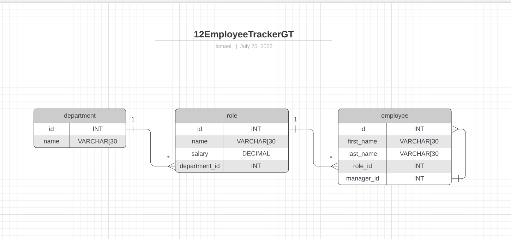

# 12EmployeeTrackerGT
Employee Tracker App


## User Story
```
AS A business owner
I WANT to be able to view and manage the departments, roles, and employees in my company
SO THAT I can organize and plan my business
```


## Locations 

GitHub Repo: https://github.com/J28819/12EmployeeTrackerGT


## Local Installation

1. To clone the repository in your computer run this command.

```bash
git clone git@github.com:J28819/12EmployeeTrackerGT.git
//go to the foler
npm init
npm install --save express
mysql> source ./db/schema.sql // to create the database in mysql
mysql> source ./db/seeds.sql // to mock data
node index.js =>  MySQL Source ./db/Schema.sql => MySQL ./dbSource Schema.sql

```

2. Follow the instructions in visual code


## Description

- This Application use the console input Employees, Roles and Departments
- The application use Inquirer to display a menu and shows different options:
    1. **View All Employees**
    2. **Add an Employee**
    3. **Update Employee Role**
    4. **View All Roles**
    5. **Add Role**
    6. **View All Departments**
    7. **Add Department**

- When Update an Employee Role the system display a list of the actual roles availables for the change to prevent the end user add a Role not in the database by mistake or typo Errors
- The Application link the information for the 3 tables with JOIN queries to display mportant information for All Employees and Roles.
- The Application has Validation for Console input to prevent nulls in the Database.
- The Application use Classes Department.js, Employee.js and Role.js to extend functions and questions for Inquirer.
- Manager_Name Column was added to display proper name for Managers in Employee Table.
- Using Console.table() function to display the results formatted.
- When View all Roles are selected it display a list for all the Roles/title and the corresponed Department Sorted by Salary Desc in order to review the highest from the company.


## ----- Bonus Activities ----
- Update employee Role. ----OK
- View employees by manager. ----OK
- View employees by department. ----OK
- View the total utilized budget of a department—in other words, the combined salaries of all employees in that department. -----OK
- Delete departments, roles, and employees. ----- Future implementation


## Acceptance Criteria

```md

GIVEN a command-line application that accepts user input ----Ok
WHEN I start the application -----Ok
THEN I am presented with the following options: view all departments, view all roles, view all employees, add a department, add a role, add an employee, and update an employee role -----Ok
WHEN I choose to view all departments -----Ok
THEN I am presented with a formatted table showing department names and department ids -----Ok
WHEN I choose to view all roles -----Ok
THEN I am presented with the job title, role id, the department that role belongs to, and the salary for that role -----Ok
WHEN I choose to view all employees -----Ok
THEN I am presented with a formatted table showing employee data, including employee ids, first names, last names, job titles, departments, salaries, and managers that the employees report to -----Ok
WHEN I choose to add a department -----Ok
THEN I am prompted to enter the name of the department and that department is added to the database -----Ok
WHEN I choose to add a role -----Ok
THEN I am prompted to enter the name, salary, and department for the role and that role is added to the database -----Ok
WHEN I choose to add an employee -----Ok
THEN I am prompted to enter the employee’s first name, last name, role, and manager, and that employee is added to the database -----Ok
WHEN I choose to update an employee role -----Ok
THEN I am prompted to select an employee to update and their new role and this information is updated in the database -----Ok

```

## Tables



 ## Screenshoots

 ## View All Departments
 
 ## View All Employees
 
 ## View All Roles
 
 ## Add Department","Add Employe
 
 ## Add Role
 
 ## Update Employee Role
 
 ## Update employee Manager
 
 ## Total Utilized Budget
 
 ## View employees by department
 
 ## View employees by Manager


  
Overview


Overview2


## Google Drive Video


## Conclusion 

 Thank you to all the GTBootcamp staff for all the support and teaching that makes this possible.


## License
[MIT](https://choosealicense.com/licenses/mit/)


